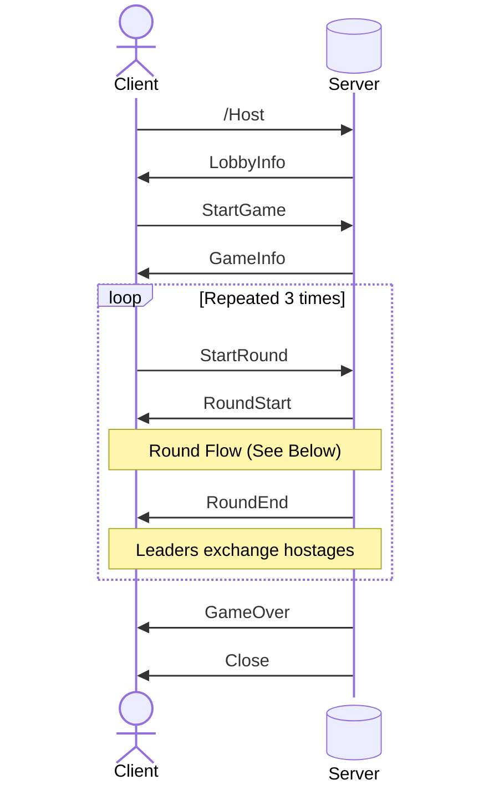
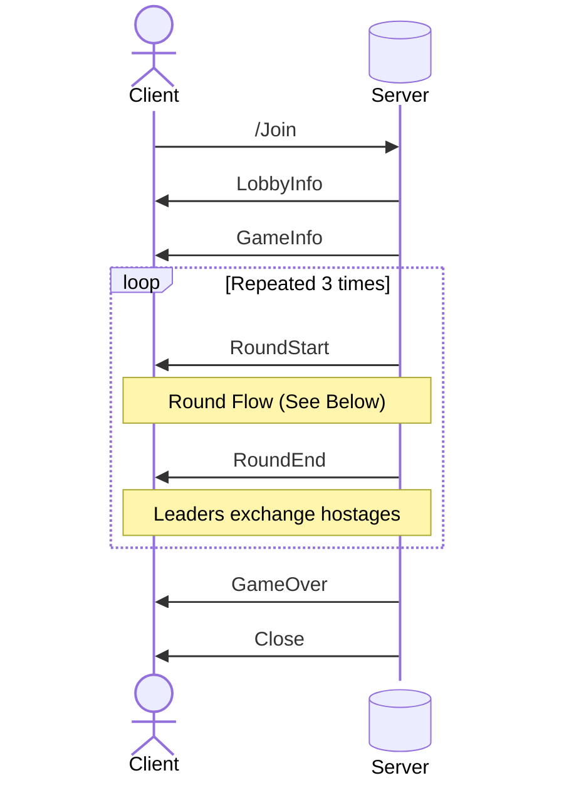
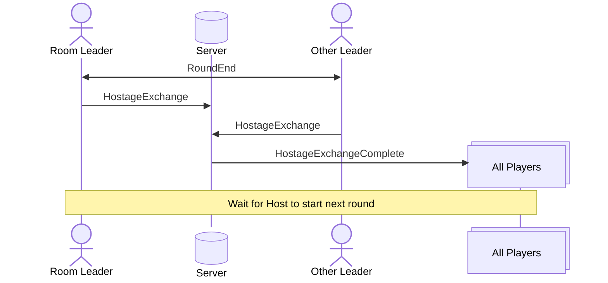
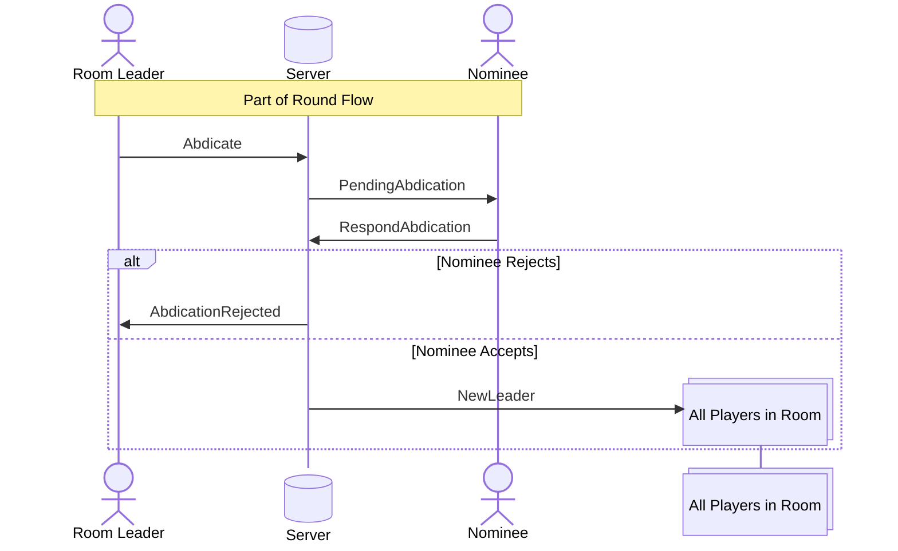
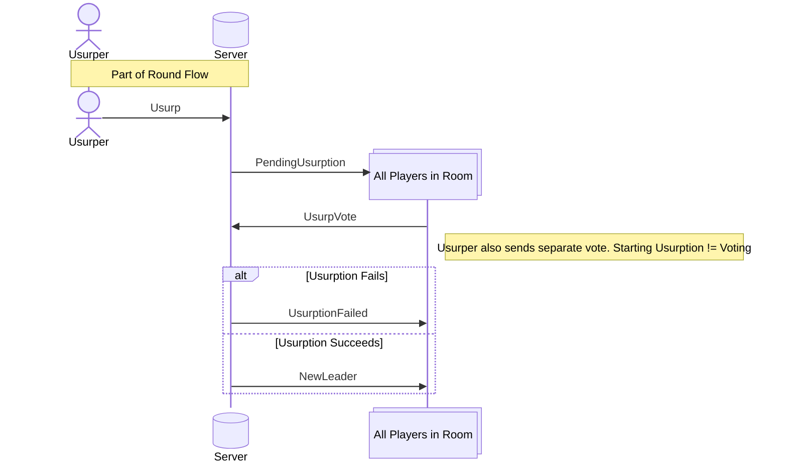
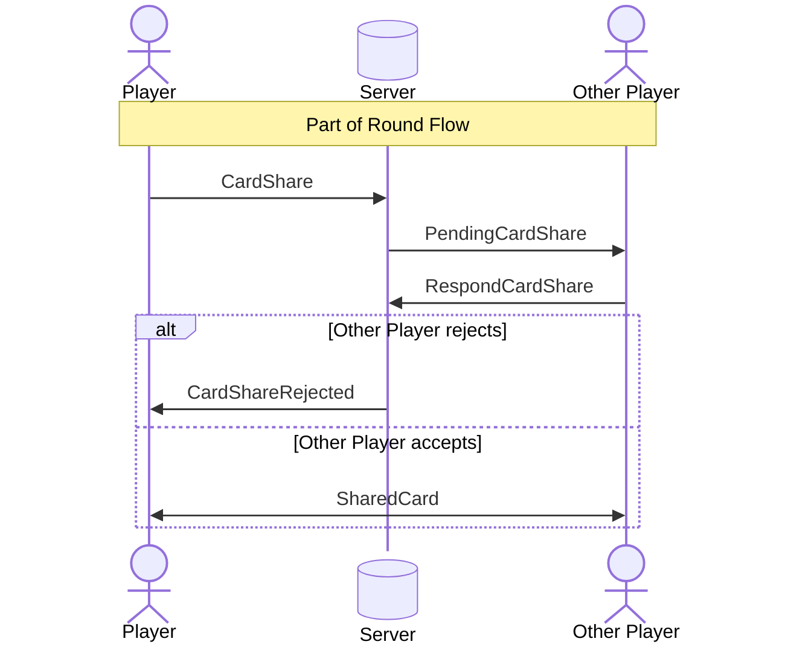

# Networking Flow
Client-Server relationships diagrammed below

## Gameplay Loop 
### Host

### Non-Host

## Round Flow
### Leaders Only
#### End-of-Round Hostage Exchange

#### Abdication

### Everyone
#### Usurption

#### Card Sharing
